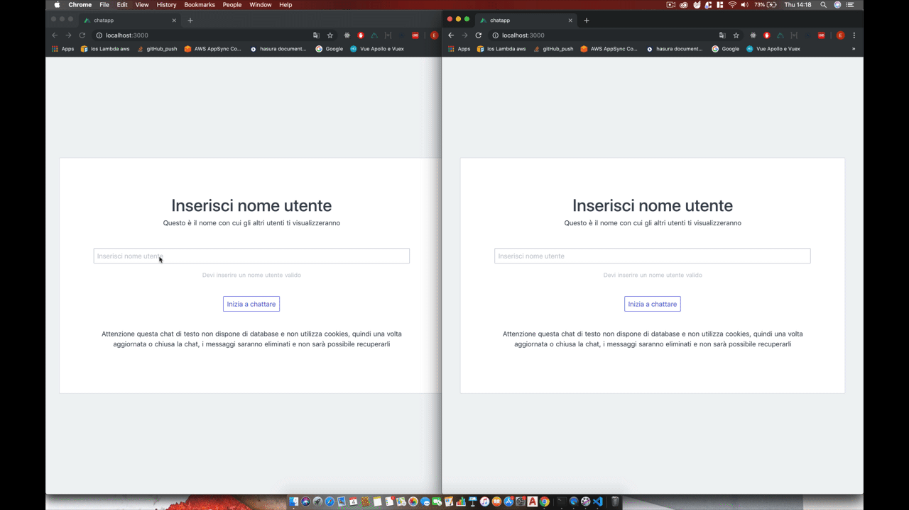

# Chat Application S2I project



> This is the project for start2impact

## Run the code

``` bash
# clone repositories.
$ git clone https://github.com/erik18xk/socket.io-nuxt-chatAPP.git

# navigate into the folder.
$ cd socket.io-nuxt-chatAPP

# install dependencies.
$ yarn install

# run the build.
$ yarn build

# start server.
$ yarn start
```

## Socket.io

The socket.io server will serve from http://localhost:8000.

## Nuxt

Nuxt ssr will serve from http://localhost:3000.

## WHAT I'VE LEARNED

1. Nuxt framework
2. Middleware
3. Vuex store, mutations, getters, actions
4. Socket.io w/ express
5. Sccket.io-client

### Keep working

Questo è un elenco di funzionalità che dovrebbero ancora essere implementate https://www.notion.so/erikolivero/Chap-App-64684bae186d4aaba71dd5116e5ecb88

